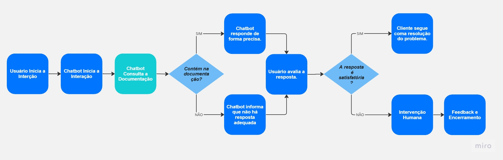
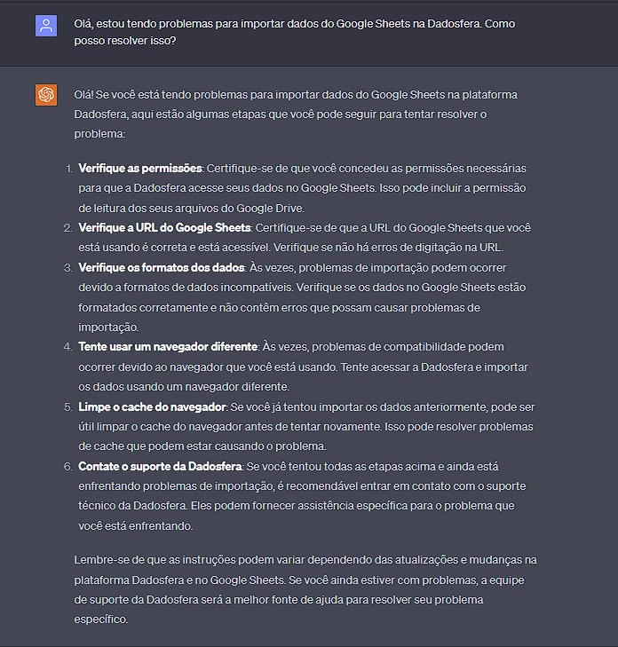

# Case Técnico

## Item 1 - Sobre Troubleshooting
 

**Resposta ao Cliente:**

Olá "Cliente",

Agradeço por entrar em contato com o suporte da Dadosfera. Lamento ouvir sobre o problema que você está enfrentando com a importação dos dados na pipeline de coleta. Estou aqui para ajudar a resolver esse problema o mais rápido possível.

Para que eu possa entender melhor a situação, seria possível fornecer mais detalhes sobre o erro específico que você está enfrentando? Qual mensagem de erro está aparecendo ou qual é o comportamento inesperado que você observou durante a importação dos dados?

Enquanto isso, vou compartilhar algumas dicas gerais que podem ajudar a solucionar problemas relacionados à importação de dados do Google Sheets para a Dadosfera:

1. **Formato de Dados**:  Certifique-se de que os dados no Google Sheets estão em um formato compatível com a Dadosfera. Os dados devem estar organizados de maneira consistente, com colunas e linhas bem definidas.
   
2. **Permissões de Acesso**: Verifique se a conta associada à Dadosfera tem as permissões corretas para acessar o Google Sheets. Isso inclui permissões de leitura para os dados necessários.

3. **URL do Google Sheets**: Certifique-se de que a URL do Google Sheets esteja correta e que o documento esteja acessível publicamente ou que a conta da Dadosfera tenha acesso apropriado.

4. **Tipos de Dados**: Verifique se os tipos de dados nas colunas do Google Sheets estão de acordo com o que é esperado pela Dadosfera. Diferenças nos tipos de dados podem causar problemas de importação.

Por favor, me forneça mais detalhes sobre o erro e, se possível, os logs relevantes da importação. Estou aqui para ajudar e resolver essa situação da melhor maneira possível.

Atenciosamente,  

Natan Nascimento  
Analista de Suporte da Dadosfera 

---
 

## Item 2 - Sobre Processos Internos
 

**1. Planejamento e Preparação:**

- **Avaliação Interna**: Realize uma avaliação interna completa da nova plataforma, incluindo testes de SSO, integrações com sistemas existentes e a eficácia dos recursos de ciclo de vida do usuário.

- **Equipe de Projeto**: Monte uma equipe de projeto multidisciplinar, incluindo especialistas técnicos, equipes de suporte e comunicação, para garantir uma implementação bem-sucedida.

- **Mapeamento de Processos**: Mapeie os processos atuais de autenticação, gerenciamento de usuário e autorizações, identificando as áreas que serão afetadas pela mudança.

**2. Comunicação Externa:**

- **Anúncio Prévio**: Comunique aos clientes sobre a próxima atualização e explique os benefícios da nova plataforma, como maior segurança e eficiência no gerenciamento de usuários.

- **Workshops e Treinamentos**: Ofereça workshops online ou presenciais para familiarizar os clientes com os novos recursos e demonstrar como eles podem otimizar suas operações.

**3. Integração de Clientes:**

- **Consultoria Personalizada**: Designe especialistas de suporte para trabalhar diretamente com os principais clientes, ajudando-os a integrar a nova plataforma em seus ambientes específicos.

- **Testes Piloto**: Convide alguns clientes para participar de testes piloto, permitindo que eles experimentem a nova plataforma em um ambiente controlado antes da implantação completa.

**4. Mitigação de Impactos no Caso Anterior:**

- **Avaliação de Compatibilidade**: Avalie como a atualização impactará a importação de dados do Google Sheets na Dadosfera. Garanta que os processos de importação sejam compatíveis com as mudanças.

- **Atualização de Documentação**: Atualize a documentação da Dadosfera para incluir informações sobre como a nova plataforma de gerenciamento de diretório afeta os processos de importação.

- **Suporte Específico**: Certifique-se de que a equipe de suporte esteja pronta para lidar com perguntas relacionadas à nova plataforma e seus possíveis impactos.

**5. Suporte Contínuo:**

- **Canais de Comunicação**: Mantenha canais abertos de comunicação com os clientes, oferecendo suporte contínuo à medida que eles se adaptam à nova plataforma.

- **Feedback e Melhorias**: Esteja aberto a feedback dos clientes e faça ajustes na implementação conforme necessário para melhor atender às suas necessidades.

**6. Pós-Implementação:**

- **Avaliação de Desempenho**: Avalie o desempenho da nova plataforma após a implementação completa, corrigindo quaisquer problemas e otimizando os processos conforme necessário.

- **Monitoramento Contínuo**: Mantenha um monitoramento constante da nova plataforma para garantir que ela esteja funcionando sem problemas e atendendo às expectativas dos clientes.

Em resumo, uma abordagem cuidadosa que inclui comunicação clara, preparação detalhada, suporte dedicado e avaliação contínua será fundamental para garantir uma transição suave e eficiente para a nova plataforma de gerenciamento de diretório em nuvem. Isso minimizará o impacto nas operações dos clientes e permitirá que eles se adaptem com sucesso às mudanças.

---
 

## Item 3 - Sobre Boas-Práticas de Suporte
 

## Implementação de uma Ferramenta de Chatbot com IA na Dadosfera

Para melhorar a satisfação e o envolvimento do cliente na Dadosfera por meio de um chatbot com IA robusta, seguiria uma abordagem estratégica centrada no cliente:

1. **Identificação de Casos de Uso:** Identificaria cenários nos quais o chatbot poderia ser útil, como consultas sobre procedimentos, solução de problemas comuns e suporte à integração.

2. **Design de Diálogo Natural:** Criaria fluxos de conversação naturais e amigáveis, considerando a linguagem e as expectativas dos clientes.

3. **Integração de Conhecimento:** Integraria o chatbot à documentação da Dadosfera (docs.dadosfera.ai) para respostas precisas e confiáveis.

4. **Personalização e Contexto:** Implementaria rastreamento de contexto para respostas personalizadas e contínuas.

5. **Feedback e Melhoria Contínua:** Coletaria feedback dos clientes após interações para melhorias contínuas.

6. **Transferência para Agentes Humanos:** Permitiria transferência suave para agentes quando necessário.

7. **Monitoramento e Análise:** Acompanharia métricas de desempenho para avaliar eficácia.

8. **Aprimoramento Gradual:** Ajustaria o chatbot com base em feedbacks e métricas.

9. **Promoção da Ferramenta:** Divulgaria o chatbot aos clientes por diversos canais.

10. **Capacitação da Equipe:** Treinaria a equipe de suporte para trabalhar em conjunto com o chatbot.

A implementação do chatbot com IA na Dadosfera melhoraria a satisfação do cliente, oferecendo suporte eficiente 24/7 e permitindo que a equipe de suporte focasse em questões complexas.

A)

 

B)

